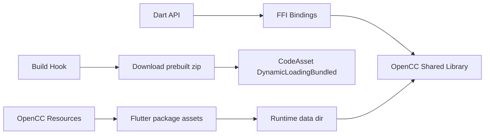

# flutter_opencc_plus 跨平台 OpenCC 封装实现文档

## 1. 目标与范围

`flutter_opencc_plus` 是一个同时服务 Dart 和 Flutter 的 OpenCC 封装包，目标是让同一个
Dart API 在 Android、iOS、macOS、Windows、Linux 上转换简体中文和繁体中文。

范围：

- 支持 OpenCC `ver.1.4.1`，即当前最新稳定版。
- 支持 `s2t`、`t2s`、`s2tw`、`tw2s`、`s2hk`、`hk2s`、`s2hkp`、`hk2sp`、
  `s2twp`、`tw2sp`、`t2tw`、`tw2t`、`t2hk`、`hk2t`、`t2jp`、`jp2t`。
- 提供 `ZhConverter` 和 `ZhTransformer` 两个核心 API。
- 提供 CLI，支持文本、文件、标准输入输出、原地替换。
- 共享库通过 native assets 打进 Dart/Flutter 应用。
- 词库资源不依赖进程环境变量，不依赖 `.dart_tool/share`。

## 2. 环境要求

| 组件 | 版本 | 说明 |
| --- | --- | --- |
| Dart SDK | `>=3.3.4 <4.0.0` | 推荐当前 stable，例如 3.12 |
| Flutter | 3.44+ | native asset bundling 已转正 |
| CMake | 3.12+ | OpenCC 最低要求 |
| Android NDK | r26+ | Android 交叉编译 |
| Xcode | 15+ | iOS/macOS 编译 |
| MSVC | VS 2022 | Windows 编译 |
| Python 3 | 3.9+ | OpenCC 词库生成 |

Android/iOS 上不存在独立 Dart 运行时，因此移动端必须通过 Flutter 工程消费此包。
桌面端可以同时用于 Flutter 应用和 Dart CLI。

## 3. 总体架构



核心设计：

1. 构建期不现场编译 OpenCC，而是从 GitHub Release 下载预编译共享库。
2. `hook/build.dart` 使用 `hooks` 2.x 和 `code_assets` 2.x 注册 code asset。
3. 词库资源通过 Flutter package assets 打包，运行时复制到可写目录或使用绝对路径。
4. FFI 绑定用 `ffigen` 从 OpenCC 1.4.1 的 `src/opencc.h` 自动生成。

## 4. 建议目录结构

```text
flutter_opencc_plus/
├── .github/
│   └── workflows/
│       ├── ci.yml
│       └── asset_build.yml
├── assets/
│   └── opencc/
│       ├── s2t.json
│       ├── t2s.json
│       ├── STPhrases.ocd2
│       └── ...
├── bin/
│   ├── flutter_opencc_plus.dart
│   └── opencc.dart
├── example/
│   └── flutter_opencc_plus_example/
├── hook/
│   ├── build.dart
│   └── link.dart
├── lib/
│   ├── flutter_opencc_plus.dart
│   └── src/
│       ├── ffi.dart
│       ├── lib_opencc.dart
│       └── resources.dart
├── native/
│   ├── CMakeLists.txt
│   └── shim/opencc_dart.cpp
├── test/
│   ├── converter_test.dart
│   └── transformer_test.dart
├── tool/
│   ├── build_native.dart
│   ├── pack_assets.dart
│   └── compile.sh
├── pubspec.yaml
├── ffigen.yaml
└── IMPLEMENTATION.md
```

## 5. pubspec.yaml 基础配置

```yaml
name: flutter_opencc_plus
description: A cross-platform OpenCC wrapper for Dart and Flutter.
version: 0.1.0
publish_to: none

environment:
  sdk: '>=3.10.0 <4.0.0'

dependencies:
  archive: ^4.1.0
  code_assets: ^2.0.0
  ffi: ^2.2.0
  hooks: ^2.2.0
  path: ^1.9.0

dev_dependencies:
  ffigen: ^20.1.1
  lints: ^6.0.0
  test: ^1.25.15

flutter:
  assets:
    - assets/opencc/
```

说明：

- `code_assets` 和 `hooks` 是 build hook 依赖。
- `archive` 用于解压预编译产物。
- 资源放在 `assets/opencc/`，由 Flutter package assets 自动打包。
- 消费方访问路径是 `packages/flutter_opencc_plus/assets/opencc/s2t.json`。

## 6. OpenCC 原生库构建矩阵

### 6.1 目标产物

| 平台 | Host | 架构 | 动态库文件名 |
| --- | --- | --- | --- |
| Android | Linux/macOS/Windows | arm64, arm, x64, ia32 | `libopencc.so` |
| iOS | macOS | arm64 device, arm64/x64 simulator | `libopencc.dylib` |
| macOS | macOS | arm64, x64 | `libopencc.dylib` |
| Windows | Windows | x64, arm64 | `opencc.dll` |
| Linux | Linux 容器 | x64, arm64 | `libopencc.so` |

### 6.2 Android

```bash
export ANDROID_NDK=/path/to/android-ndk

cmake -S . -B build/android-arm64 \
  -DCMAKE_TOOLCHAIN_FILE=$ANDROID_NDK/build/cmake/android.toolchain.cmake \
  -DANDROID_ABI=arm64-v8a \
  -DANDROID_PLATFORM=android-21 \
  -DBUILD_SHARED_LIBS=ON \
  -DBUILD_OPENCC_JIEBA_PLUGIN=OFF

cmake --build build/android-arm64 --config Release --target libopencc Dictionaries
```

建议 Android ABI：

- `arm64-v8a`：必须。
- `armeabi-v7a`：建议。
- `x86_64`：建议，用于模拟器。
- `x86`：可选，仅老模拟器需要。

### 6.3 iOS

真机：

```bash
cmake -S . -B build/ios-device \
  -DCMAKE_SYSTEM_NAME=iOS \
  -DCMAKE_OSX_SYSROOT=iphoneos \
  -DCMAKE_OSX_ARCHITECTURES=arm64 \
  -DCMAKE_OSX_DEPLOYMENT_TARGET=13.0 \
  -DBUILD_SHARED_LIBS=ON \
  -DBUILD_OPENCC_JIEBA_PLUGIN=OFF

cmake --build build/ios-device --config Release --target libopencc Dictionaries
```

模拟器：

```bash
cmake -S . -B build/ios-simulator \
  -DCMAKE_SYSTEM_NAME=iOS \
  -DCMAKE_OSX_SYSROOT=iphonesimulator \
  -DCMAKE_OSX_ARCHITECTURES=arm64 \
  -DCMAKE_OSX_DEPLOYMENT_TARGET=13.0 \
  -DBUILD_SHARED_LIBS=ON \
  -DBUILD_OPENCC_JIEBA_PLUGIN=OFF

cmake --build build/ios-simulator --config Release --target libopencc Dictionaries
```

iOS 的 build hook 会收到 `IOSSdk.iPhoneOS` 或 `IOSSdk.iPhoneSimulator`，所以发布
时保留 `iphoneos` 和 `iphonesimulator` 两种后缀。

### 6.4 macOS

```bash
cmake -S . -B build/macos \
  -DCMAKE_OSX_ARCHITECTURES="arm64;x86_64" \
  -DCMAKE_OSX_DEPLOYMENT_TARGET=10.15 \
  -DBUILD_SHARED_LIBS=ON \
  -DBUILD_OPENCC_JIEBA_PLUGIN=OFF

cmake --build build/macos --config Release --target libopencc Dictionaries
```

也可以按架构分别编译后用 `lipo -create` 合并成通用二进制。

### 6.5 Windows

```bash
cmake -S . -B build/windows-x64 \
  -G "Visual Studio 17 2022" \
  -A x64 \
  -DBUILD_SHARED_LIBS=ON \
  -DBUILD_OPENCC_JIEBA_PLUGIN=OFF

cmake --build build/windows-x64 --config Release --target libopencc Dictionaries
```

arm64 使用 `-A arm64`。Windows 需要确认 `OPENCC_EXPORT` 导出符号以及
MSVC 运行库依赖。

### 6.6 Linux

```bash
cmake -S . -B build/linux-x64 \
  -DCMAKE_BUILD_TYPE=Release \
  -DBUILD_SHARED_LIBS=ON \
  -DBUILD_OPENCC_JIEBA_PLUGIN=OFF

cmake --build build/linux-x64 --config Release --target libopencc Dictionaries
```

为了兼容旧系统，建议在 Ubuntu 18.04 或 20.04 容器内编译，避免引入过新的 glibc。

### 6.7 词库资源

词库和配置文件是平台无关的：

```text
data/config/*.json
data/*.ocd2
```

这些文件只需要生成一次，然后复制进每个平台 zip。发布 zip 的结构：

```text
opencc-windows-x64.zip
├── opencc.dll
└── opencc/
    ├── s2t.json
    ├── t2s.json
    ├── STPhrases.ocd2
    ├── STCharacters.ocd2
    └── ...
```

## 7. 发布产物命名

约定 hook 直接通过 `targetOS` 和 `targetArchitecture` 推导下载地址：

```text
opencc-<os>-<arch>.zip
opencc-ios-iphoneos-arm64.zip
opencc-ios-iphonesimulator-arm64.zip
```

每个 zip 必须附 `SHA256SUMS` 或单独 `.sha256` 文件，hook 下载后校验。

## 8. Build Hook 实现

核心文件是 `hook/build.dart`。

```dart
import 'dart:io';

import 'package:archive/archive.dart';
import 'package:code_assets/code_assets.dart';
import 'package:hooks/hooks.dart';

const _libName = 'opencc';
const _baseUrl =
    'https://github.com/openAnimeFlow/flutter_opencc_plus/releases/latest/download';

void main(List<String> args) async {
  await build(args, (input, output) async {
    if (!input.config.buildCodeAssets) {
      return;
    }

    final code = input.config.code;
    final os = code.targetOS;
    final arch = code.targetArchitecture;
    final iosSdk = os == OS.iOS ? code.iOS.targetSdk : null;
    final suffix = iosSdk == null ? '' : '-${iosSdk.type}';
    final archiveName = 'opencc-${os.name}-${arch.name}$suffix.zip';
    final archiveUri = input.outputDirectory.resolve(archiveName);
    final archiveFile = File.fromUri(archiveUri);

    if (!archiveFile.existsSync()) {
      await _download(Uri.parse('$_baseUrl/$archiveName'), archiveFile);
    }

    final archiveInput = InputFileStream(archiveFile.path);
    final zip = ZipDecoder().decodeStream(archiveInput);
    final libName = os.dylibFileName(_libName);
    final libEntry = zip.find(libName);
    if (libEntry == null || !libEntry.isFile) {
      throw StateError('$archiveName does not contain $libName');
    }

    final libFile = File.fromUri(input.outputDirectory.resolve(libName));
    final output = OutputFileStream(libFile.path);
    libEntry.writeContent(output);
    output.closeSync();
    archiveInput.closeSync();

    output.assets.code.add(
      CodeAsset(
        package: input.packageName,
        name: 'src/lib_opencc.dart',
        linkMode: DynamicLoadingBundled(),
        file: libFile.uri,
      ),
    );
    output.dependencies.add(archiveUri);
  });
}

Future<void> _download(Uri uri, File target) async {
  final client = HttpClient();
  final request = await client.getUrl(uri);
  final response = await request.close();
  if (response.statusCode != 200) {
    throw StateError('Download failed: $uri (${response.statusCode})');
  }
  await target.create(recursive: true);
  await response.pipe(target.openWrite());
}
```

要点：

- `name: 'src/lib_opencc.dart'` 必须与 FFI 绑定文件路径一致。
- `DynamicLoadingBundled` 表示共享库会随应用一起打包。
- `input.outputDirectory` 按 target config 做缓存，避免重复下载。
- 增加 `.sha256` 校验，防止下载损坏或供应链篡改。
- 如果以后要从源码构建，可在 hook 内调用 `native_toolchain_c`。

## 9. FFI 绑定

用 `ffigen` 生成 `lib/src/lib_opencc.dart`。

`ffigen.yaml`：

```yaml
name: FlutterOpenCCBindings
output: 'lib/src/lib_opencc.dart'
headers:
  entry-points:
    - 'third_party/opencc/src/opencc.h'
include-directives:
  - 'third_party/opencc/src/opencc.h'
ffi-native:
```

生成命令：

```bash
dart run ffigen --config ffigen.yaml
```

生成的函数签名：

```dart
@ffi.Native<opencc_t Function(ffi.Pointer<ffi.Char>)>(symbol: 'opencc_open')
external opencc_t opencc_open(
  ffi.Pointer<ffi.Char> configFileName,
);
```

因为绑定文件在 `lib/src/lib_opencc.dart`，默认 asset id 是
`package:flutter_opencc_plus/src/lib_opencc.dart`，和 build hook 中注册的 code asset
名称一致。

## 10. Dart API 设计

### 10.1 ZhConverter

```dart
import 'src/lib_opencc.dart' as ffi;
import 'src/ffi.dart' show CharArray;

final class ZhConverter {
  final ffi.opencc_t _native;
  final CharArray _str;
  final CharArray _buf;
  bool _disposed = false;

  ZhConverter(OpenCCConfig config, {required String dataDir})
    : this._(_open(dataDir, config.configName));

  ZhConverter._(this._native, this._str, this._buf);

  static (ffi.opencc_t, CharArray, CharArray) _open(
    String dataDir,
    String config,
  ) {
    final path = '$dataDir/$config.json';
    final str = CharArray.from(path);
    final buf = CharArray(size: 1024);
    final native = ffi.opencc_open(str.pointer);
    if (native.address < 0) {
      throw StateError(ffi.opencc_error().toDartString());
    }
    return (native, str, buf);
  }

  String convert(String text) {
    _str.pavedBy(text);
    _buf.resize(_str.length + 1);
    final len = ffi.opencc_convert_utf8_to_buffer(
      _native,
      _str.pointer,
      _str.length,
      _buf.pointer,
    );
    if (len < 0) {
      throw StateError('OpenCC conversion failed.');
    }
    return _buf.dartString;
  }

  void dispose() {
    if (_disposed) {
      return;
    }
    _disposed = true;
    ffi.opencc_close(_native);
    _buf.dispose();
    _str.dispose();
  }
}
```

### 10.2 ZhTransformer

```dart
final class ZhTransformer extends StreamTransformerBase<String, String> {
  final ZhConverter _converter;

  ZhTransformer(OpenCCConfig config, {required String dataDir})
    : _converter = ZhConverter(config, dataDir: dataDir);

  @override
  Stream<String> bind(Stream<String> stream) async* {
    var pending = '';
    await for (final chunk in stream) {
      final parts = (pending + chunk).split(RegExp(r'\r?\n'));
      pending = parts.removeLast();
      for (var i = 0; i < parts.length; i++) {
        if (i > 0) {
          yield '\n';
        }
        if (parts[i].trim().isNotEmpty) {
          yield _converter.convert(parts[i]);
        } else {
          yield parts[i];
        }
      }
    }
    if (pending.isNotEmpty) {
      yield _converter.convert(pending);
    }
  }
}
```

### 10.3 CLI

```text
opencc [-i] [-c s2t|t2s|...] [--data-dir <dir>] <text|file>...
```

`--data-dir` 是必选或可配置项，禁止隐式依赖 `.dart_tool/share`。

## 11. 资源加载策略

OpenCC 的 `opencc_open` 只接收配置文件名，资源查找依赖配置所在目录或
`OPENCC_DATA_DIR`。为了保证跨平台可靠，不要依赖进程环境变量。

### 11.1 方案 A：复制资源到可写目录

适合 MVP，最简单。

```dart
Future<String> prepareDataDir() async {
  final root = Directory.systemTemp.createTempSync('flutter_opencc_plus_');
  final names = await _listOpenCCAssets();
  for (final name in names) {
    final data = await rootBundle.load(
      'packages/flutter_opencc_plus/assets/opencc/$name',
    );
    final file = File('${root.path}/$name');
    await file.writeAsBytes(data.buffer.asUint8List(), flush: true);
  }
  return root.path;
}
```

说明：

- Android APK assets 不能直接作为文件路径传给 C++，必须先复制。
- iOS/macOS 可以把资源放进 app bundle，直接使用绝对路径，不一定要复制。
- Windows/Linux 可以使用可执行文件旁的资源目录，或用户传入的目录。
- 建议用 `path_provider` 的 cache/application support 目录，不要用 `Directory.systemTemp`。

### 11.2 方案 B：C++ shim 使用 ResourceProvider

OpenCC 1.4.1 C++ API 提供 `FilesystemResourceProvider`，可以显式传入资源目录。

```cpp
#include <memory>
#include <string>
#include <vector>

#include "opencc/SimpleConverter.hpp"
#include "opencc/ResourceProvider.hpp"

extern "C" {

void* opencc_dart_open(const char* configName, const char* dataDir) {
  try {
    auto resources = std::make_shared<opencc::FilesystemResourceProvider>(
        std::vector<std::string>{dataDir});
    auto converter = std::make_shared<opencc::SimpleConverter>(
        std::string(configName), resources);
    return converter.release();
  } catch (...) {
    return reinterpret_cast<void*>(-1);
  }
}

}  // extern "C"
```

这样就不需要依赖 `OPENCC_DATA_DIR` 或当前目录。后续还可以改用
`ZipResourceProvider`，把词库打包成单个 zip 资源文件。

### 11.3 方案 C：data_assets

Dart 官方已有实验性的 `package:data_assets`，可在 build hook 中输出 data asset，
但该功能仍标记为 experimental。MVP 不要依赖它，先使用方案 A 或 B。

## 12. 生命周期与错误处理

- `dispose()` 必须幂等，重复调用不能 crash。
- `convert()` 失败时不要自动 `dispose()`，让调用方决定是否释放。
- 一个 `ZhConverter` 不要跨 isolate 使用；每个 isolate 创建自己的 converter。
- 如果要在并发场景共享，建议用 `synchronized` 锁或每个 isolate 独立实例。
- `CharArray` 释放后不能继续使用。

## 13. 测试计划

### 13.1 Dart 单元测试

覆盖：

- `s2t`、`t2s`。
- 空字符串、空白、换行。
- 中英文混排。
- 多字节 UTF-8 长文本。
- 不存在的配置。
- 重复 `dispose()`。
- 流式输入分块，包括换行被切到下一 chunk 的情况。

### 13.2 Flutter 集成测试

在示例工程中验证：

- Android 模拟器：`flutter build apk --debug` 后执行转换。
- iOS 模拟器：`flutter build ios --simulator`。
- macOS：`flutter run -d macos`。
- Windows：`flutter run -d windows`。
- Linux：`flutter run -d linux`。

### 13.3 原生库冒烟测试

每个发布 zip 都应该包含一个最小 C 或 Dart 冒烟测试，验证：

- 动态库可加载。
- `s2t.json` 存在。
- `STPhrases.ocd2` 等词库存在。
- 转换结果正确。

## 14. CI 配置

### 14.1 原生库构建 workflow

触发条件：

- tag：`opencc-v*`。
- 手动 `workflow_dispatch`。

建议 job：

```yaml
strategy:
  fail-fast: false
  matrix:
    include:
      - name: android-arm64
        runner: ubuntu-latest
      - name: android-arm
        runner: ubuntu-latest
      - name: android-x64
        runner: ubuntu-latest
      - name: ios-iphoneos-arm64
        runner: macos-14
      - name: ios-iphonesimulator-arm64
        runner: macos-14
      - name: macos-x64
        runner: macos-13
      - name: macos-arm64
        runner: macos-14
      - name: windows-x64
        runner: windows-latest
      - name: windows-arm64
        runner: windows-latest
      - name: linux-x64
        runner: ubuntu-latest
      - name: linux-arm64
        runner: ubuntu-24.04-arm
```

每个 job 输出统一命名的 zip，最后汇总发布。

### 14.2 Dart/Flutter 测试 workflow

```yaml
on:
  push:
  pull_request:

jobs:
  test:
    strategy:
      matrix:
        os: [ubuntu-latest, windows-latest, macos-14]
    runs-on: ${{ matrix.os }}
    steps:
      - uses: actions/checkout@v4
      - uses: subosito/flutter-action@v2
        with:
          channel: stable
      - run: flutter pub get
      - run: dart analyze
      - run: flutter test
```

移动端测试建议增加 Android emulator 和 iOS simulator job。

## 15. 发布流程

1. 更新 `opencc-version` 文件，固定为 `ver.1.4.1`。
2. 打 `opencc-v1.4.1` tag，触发原生库构建。
3. 共享库和词库打包上传到 GitHub Release。
4. 打 `v0.1.0` tag，发布 Dart 包到 pub.dev。
5. README 中写明 OpenCC 版本、ABI 版本和词库版本。

## 16. 可复用旧项目内容

旧 `opencc-dart` 中以下内容可以直接参考：

- `lib/opencc.dart` 的 API 形状。
- `lib/src/ffi.dart` 的 `CharArray`。
- `bin/opencc.dart` 的 CLI 参数模型。
- `test/basic_test.dart` 的测试用例。

以下内容不要直接搬：

- `hook/build.dart` 旧版 API。
- `OPENCC_SHARED_DIR` 和 `.dart_tool/share` 运行时依赖。
- `ffigen.yaml` 中失效的 `src/src/opencc.h` 路径。

## 17. 里程碑

### M1：桌面端可用

- [ ] 创建包骨架。
- [ ] 生成 FFI 绑定。
- [ ] 实现 build hook。
- [ ] Windows/Linux/macOS 三个平台跑通 `ZhConverter`。

### M2：Android 可用

- [ ] Android NDK 构建 4 个 ABI。
- [ ] Android 资源复制方案。
- [ ] Android 模拟器集成测试。

### M3：iOS 可用

- [ ] iOS 真机和模拟器动态库。
- [ ] iOS bundle 资源路径。
- [ ] iOS 模拟器集成测试。

### M4：工程化

- [ ] CLI 完善。
- [ ] CI 发布矩阵。
- [ ] SHA-256 校验。
- [ ] pub.dev 发布。

## 18. 验收标准

以下场景全部通过即认为完成：

1. `flutter run` 在 Android、iOS、macOS、Windows、Linux 上成功。
2. 五个平台都能执行 `s2t` 和 `t2s` 转换。
3. 不设置 `OPENCC_SHARED_DIR` 也能运行。
4. `dart analyze` 无错误。
5. 单元测试和平台集成测试全部通过。
6. Release 产物带版本号、校验和和 OpenCC 版本说明。
